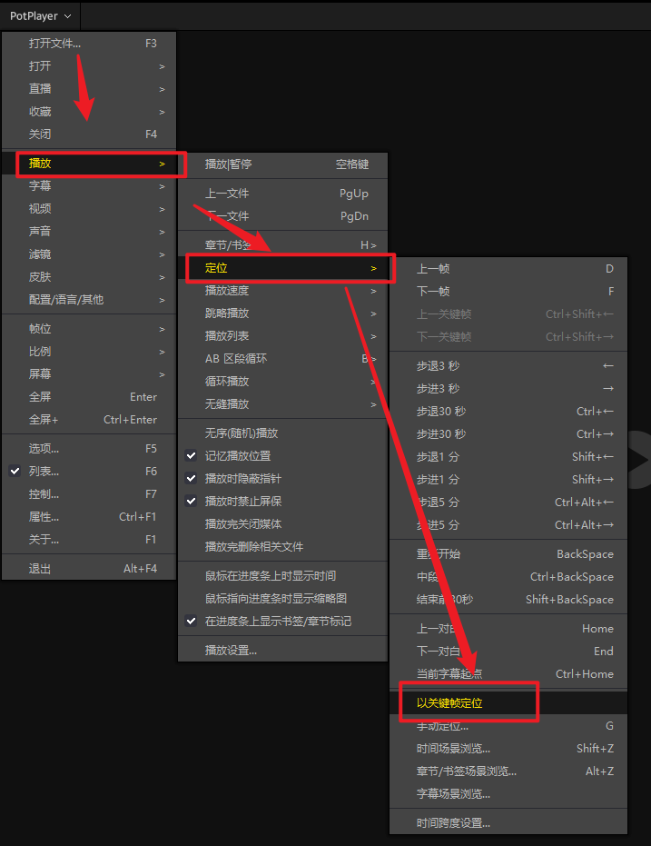

# 帮助

## 数据存储存储在哪里？

​	软件用到了2个配置，都存在于系统用户目录，一般为：`C:\Users\<user>\AppData\Roaming`，Windows上可以通过在地址栏输入`%appdata%`快速到达

- `jve_data.db`：跳转链接数据库，存储所有跳转链接信息

- `jve_settings.json`：软件的配置信息，存储软件的配置信息，如是否开机启动等。

## 是否应该使用本软件？

1. 如果您之前由于”`JumpVideo`项目发起者风波“造成旧版`JumpVideo`无法使用，并且没有使用其他软件。我们十分感谢您的等待与支持。并且欢迎您使用这款全新架构，全新设计，全新交互并且开源的`JumpVideo-Electron`
2. 如果您已经使用其他的一些软件（免费或付费），并且其他软件已经完全满足你的需求。我们建议您不用更换。
3. 当然，如果您对开源软件比较信任，或者对全新开源的`JumpVideo-Electron`的一些设计交互比较看好，你可以尝试使用后，并选择是否迁移过来。迁移过程中有任何问题可以联系我们
4. 为了体现对开源软件的支持。我们提供了从`markdown2potplayer` 一键迁移的脚本。如果你之前使用过`markdown2potplayer`，我们建议您迁移。本项目已经覆盖`markdown2potplayer`的所有功能

## 是否支持mac？

​	虽然`JumpVideo-Electron`能够天然的跨平台，我们可以很方便的发布跨平台版本。但由于mac设备，mac适配，以及mac的使用人数，我们对此问题保持观望态度。也许在不久之后，我们开发mac的适配版本

## 是否收费？

​	本软件永远全功能开源免费。

## 为什么不能截图和链接一起粘贴？

​	功能上是可以实现的，但受限于不同笔记软件的差异。粘贴后的图片保存差异情况。目前测试了`Obsidian `和 `Typora`。发现只有`Typora`能够很好的处理图片位置问题。为了软件的统一，获取截图不再携带链接。

## 为什么potplayer时间跳转不准确？

关闭【potplayer以关键帧为定位】，位置受【选项-播放-定位-以关键帧定位】关掉此选项。则跳转时间非常精准

## 反馈

- 您可以通过关于里面的群聊，加群反馈。
- 或者进入项目 [Github](https://github.com/GMYXDS/jumpvideo-electron) 提相关 [Issue](https://github.com/GMYXDS/jumpvideo-electron/issues)。

