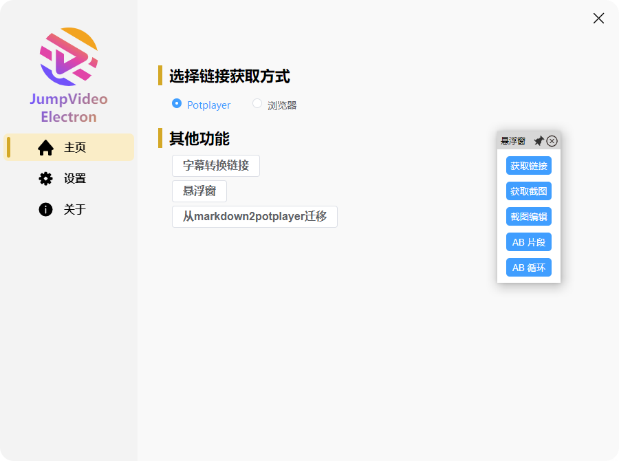
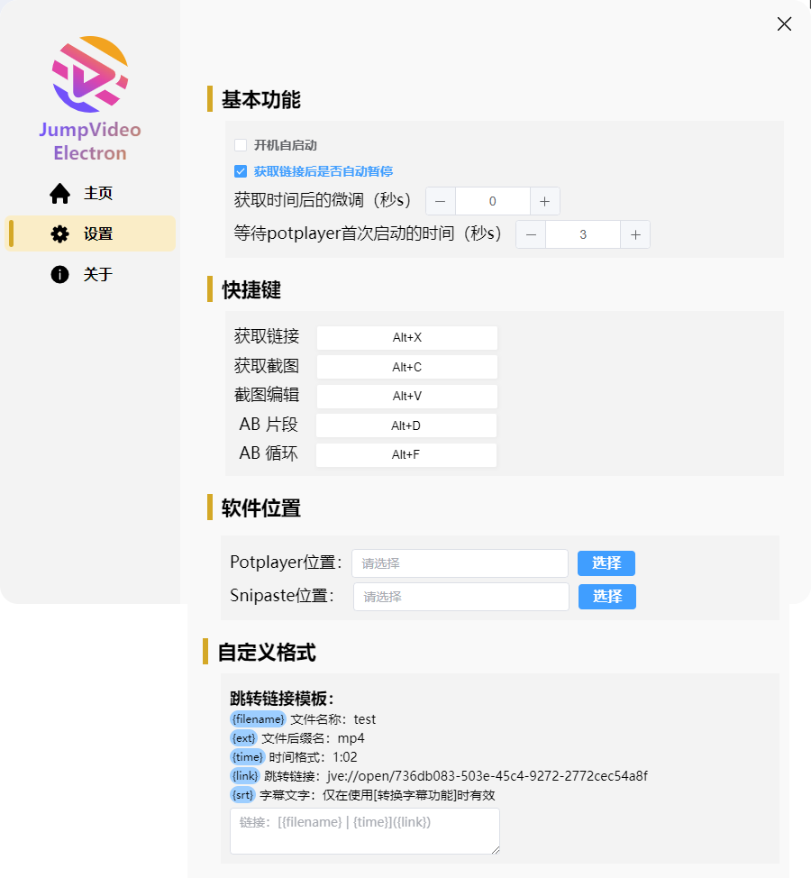
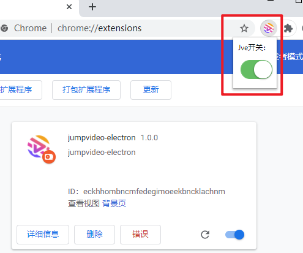
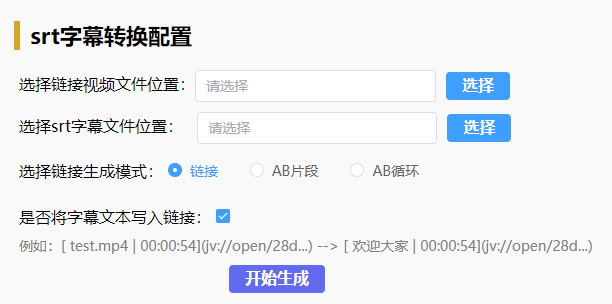
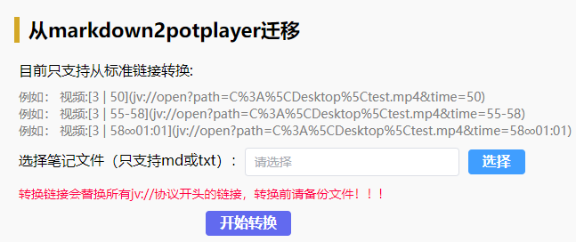
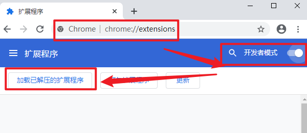

# 使用指南

## 软件截图



<br/>



<br/>



## 功能介绍

### 获取链接

从 potplayer 或者 浏览器 获取当前的时间戳，并将链接存入剪切板

### 获取截图

从 potplayer 或者 浏览器 获取当前截图，并将链接存入剪切板

### 截图编辑

从 potplayer 或者 浏览器 获取当前截图，并调用 [Snipaste](https://www.snipaste.com/) 软件进行截图编辑。注意 [Snipaste](https://www.snipaste.com/) 软件需要提前设置位置

### AB片段

通过2次从 potplayer 或者 浏览器 获取的时间戳，组成一个时间数组，并在跳转之后播放一次，并将链接存入剪切板

### AB循环

通过2次从 potplayer 或者 浏览器 获取的时间戳，组成一个时间数组，并在跳转之后循环播放，并将链接存入剪切板

如果想要关闭AB循环，potpalyer上按`\`键关闭 或者 按暂停，浏览器上按暂停

### 字幕转换链接

可以将字幕`srt`文件批量转换成对应链接，注意只支持下面格式的`srt`

```bash
0
00:00:05,320 --> 00:00:07,180
观众老爷们大家好
```



### 悬浮窗

可以打开一个全局可拖动的悬浮窗，方便用户操作，也可以通过在设置里面绑定对应的快捷键来触发对应的功能。

### 从markdown2potplayer迁移

方便之前使用 [markdown2potplayer](https://github.com/livelycode36/markdown2potplayer) 的用户可以通过这个功能快速迁移到 `jumpvideo-electron` 。选择对应的md或者txt文件，软件会自动读取之前的跳转信息，并生成新的连接，并生成一个新的副本文件，用户检查副本中的跳转没问题之后，就可以删除原版文件



### 浏览器插件使用


::: danger

当使用浏览器插件的时候，记得在软件首页设置一下链接获取的位置。默认是从Potplayer获取。

只有当你的页面右上角显示这个图标，才表示插件可用，双击可用关闭这个图标。

:::

## 补充说明

- 当从笔记中打开一个新的链接，如果此时没有启动`potplayer`或者`web浏览器`，`potplayer`的启动会消耗一定的时间，未完全启动前，无法做任何跳转。设置中的 `等待potplayer首次启动的时间（秒s）` 选项就是设置跳转的等待时间。大家可以根据自己电脑的情况进行微调。如果首次点击没有效果，可以等播放软件启动后再点击链接。
- web浏览器上的视频跳转，目前只支持B站，百度云，腾讯视频这种有固定网址的网站。测试发现天翼，迅雷，阿里，123pan打开视频都是弹窗打开，web无法捕获具体的视频路径，无法实现跳转。


## 插件安装

1. 首先从 Github 或者 蓝奏云 下载浏览器插件的 压缩包
2. 让后将浏览器插件解压到一个固定的位置（这个文件夹不能删除, 例如解压到了test文件夹）
3. 打开Chrome浏览器，地址栏输入  `chrome://extensions/`, 勾择开发者模式，点击'加载已解压的扩展程序'
   1. 选择你刚刚.zip`文件解压所在的test文件夹，点击确定。扩展程序列表出现你导入的扩展程序即为成功。
   2. 或者直接将test文件夹拖入浏览器`chrome://extensions/`页面



图文教程：https://docs.authing.cn/v2/guides/asa/chrome-manual-install.html

## 推荐的流程

1. 下载客户端程序`jumpvideo-electron-1.0.0-setup.exe` 和 扩展 `jumpvideo-extension-1.0.0.zip`
2. 安装好客户端和浏览器插件【如果需要插件】
3. 点击【设置】->【软件位置】设置好potplayer 位置和snipaste位置
4. 关闭potplayer中的【选项-播放-定位-以关键帧定位】这个功能，不然跳转时间不准确
5. 开始使用跳转链接相关功能